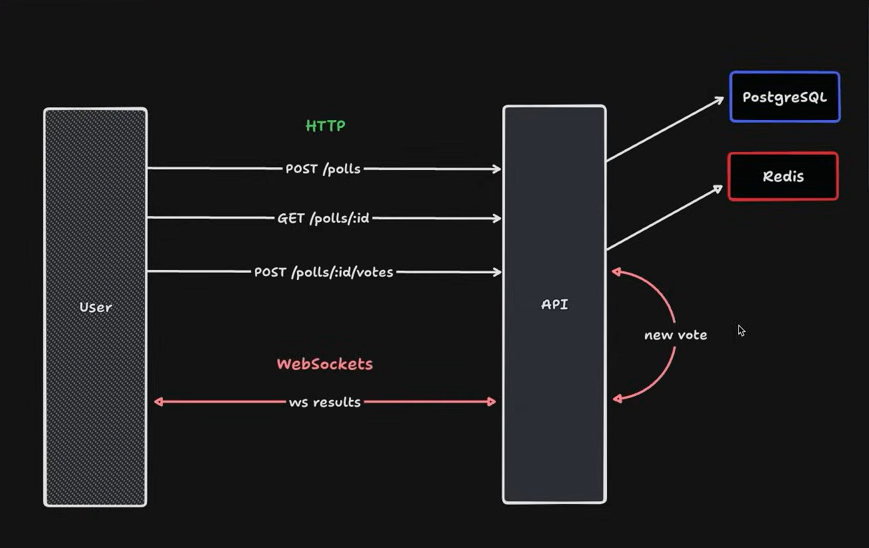

# NWL Node JS Votes Websocket

This polling API stands out with the integration of a WebSocket route. Every time a vote is created, the corresponding WebSocket route automatically notifies all connected clients, providing a real-time experience to track updates in the polls.


## Project Preview




## How to use

- Install [**Node JS**](https://nodejs.org/en)
- Install [**Docker**](https://www.docker.com/)
- Navigate to the project folder.
- Open terminal and run the following commands:

```bash
    docker-compose up -d
    npm install
    npm run start:dev
```

## Documentation

- POST /polls
    - Description: This route is responsible for creating a poll.
    - Request body (**required**)
         ```json
        {
            "title": string,
            "options": string[]
        }
        ```
    - Response (**Sucess**)
        ```json
        {
            "pollID": string
        }
        ```

- GET /polls/:pollID
     - Description: This route is responsible for to get a specify poll.

    - URL Params: The poll id (**required**)

    - Response (**Sucess**)
        ```json
        {
            "id": string,
            "title": string,
            "createdAt": Date,
            "updatedAt": Date,
            "options": [
                {
                    "id": string,
                    "title": string,
                    "votesCount": number
                }
            ]
        }
        ```
     - Response (**Error**)
        ```json
        {
            "message": string,
            "statusCode": number
        }
        ```
    
    
    
- POST /polls/:pollID/votes
    - Description: This route is responsible for creating a vote for a specific poll.
    - URL Params: The poll id (**required**)

    - Request body (**required**)
         ```json
        {
           "pollOptionID": string
        }
        ```
    - Response (**Sucess**)
        ```json
        {
            "id": string,
            "createdAt": Date,
            "poll": {
                "id": string,
                "title": string,
                "createdAt": Date,
                "updatedAt": Date
            },
            "votedPollOption": [
                {
                    "id": string,
                    "title": string,
                    "votesCount": number
                }
            ]
        }
        ```
     - Response (**Error**)
        ```json
        {
            "message": string,
            "statusCode": number
        }
        ```
    